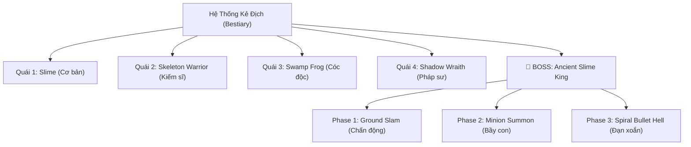

# 🎮 KẾ HOẠCH PHASE 4: THE INDIE POLISH & EXPANSION
*(Nâng tầm Survival Game thành một siêu phẩm Indie hoàn chỉnh)*

---

## 📌 TỔNG QUAN YÊU CẦU & MỤC TIÊU

| # | Vấn đề / Yêu cầu | Giải pháp kỹ thuật chuẩn Indie |
|---|---|---|
| **1** | Camera zoom quá xa (nhân vật bé) | Tăng default zoom lên **3.5x - 4.0x** + Thêm tính năng **Cuộn chuột (Mouse Wheel)** để zoom in/out linh hoạt + Camera smoothing. |
| **2** | Cung tên bắn lúc trúng lúc lệch | Xóa bỏ thuật toán `randi_range` gây lệch toạ độ, khóa vector bay thẳng 100% theo hướng con trỏ chuột (`get_global_mouse_position()`). |
| **3** | Chưa có số sát thương khi đánh | Xây dựng hệ thống **Floating Damage Numbers** nảy lên, đổi màu theo loại đòn đánh (Vàng/Cam crit, Đỏ khi bị đánh, Xanh hồi máu). |
| **4** | UI mặc định còn thô và đơn điệu | Thiết kế lại **HUD Pixel-art**: Thanh máu có hiệu ứng "Ghost Drain" (vạch trắng tụt dần kiểu *Dark Souls/Hollow Knight*), Hotbar chọn vũ khí góc dưới, Con trỏ ngắm tâm (Custom Crosshair). |
| **5** | Thiếu vũ khí cận chiến & skin | Thêm **Kiếm (Sword)** với hiệu ứng chém vòng cung (Slash Arc) + Knockback đẩy lùi quái. Hỗ trợ đổi skin nhân vật (Green Adventurer / Red Worker). |
| **6** | Quái ít và chưa có Boss | Tận dụng asset gốc & logic mới để tạo **3 quái độc đáo** (Skeleton Warrior, Swamp Frog, Shadow Wraith) + **1 Boss Chúa Tể 3 Phase** có thanh HP hoành tráng. |

---

## 🔍 CHI TIẾT KỸ THUẬT TỪNG TÍNH NĂNG

### 1. Camera & Góc nhìn (Camera2D Rework)
- **Vấn đề hiện tại:** Viewport 1920x1080 nhưng zoom chỉ 2.5x khiến nhân vật 32x32px chỉ chiếm ~80px trên màn hình (rất bé, khó quan sát chi tiết pixel art).
- **Giải pháp:**
  - `zoom` mặc định đổi từ `Vector2(2.5, 2.5)` thành `Vector2(3.5, 3.5)`.
  - Bật tính năng bám mượt: `position_smoothing_enabled = true`, `position_smoothing_speed = 7.0`.
  - Hỗ trợ cuộn chuột:
    - Lăn chuột lên: Zoom cận cảnh tới `4.5x` (ngắm nhân vật, chặt cây, nhặt đồ).
    - Lăn chuột xuống: Zoom rộng ra `2.8x` (quan sát toàn cảnh chiến trường khi đánh Boss).
  - Thêm hiệu ứng rung màn hình nhẹ (Screen Shake) khi bắn tên hoặc bị quái vồ trúng.

---

### 2. Chuẩn hoá Bắn Cung 100% Thẳng Hàng (Pinpoint Archery)
- **Nguyên nhân bắn lệch:** Trong code gốc `player.gd`, tác giả cố tình thêm độ lệch:
  ```gdscript
  # Code cũ gây lệch:
  arrow_instance.global_position = marker.global_position + Vector2(randi_range(...), randi_range(...))
  ```
- **Code chuẩn hoá mới:**
  ```gdscript
  func shoot_arrow():
      var arrow = arrow_scene.instantiate()
      arrow.global_position = global_position
      # Góc quay chuẩn xác tuyệt đối theo hướng chuột
      arrow.rotation = (get_global_mouse_position() - global_position).angle()
      get_parent().add_child(arrow)
  ```
- **Cải tiến thêm:**
  - Thay chuột Windows mặc định bằng **Tâm ngắm Pixel-art (Crosshair)** xoay theo chuột.
  - Tốc độ tên bay tăng từ 300 lên 420px/s để tạo cảm giác lực bắn dứt khoát.

---

### 3. Hệ thống Số Sát Thương Bay (Floating Damage Numbers)
- Tạo một Scene nhẹ `FloatingText.tscn`:
  - Thành phần: `Marker2D` chứa `Label` font pixel art có viền đổ bóng (outline).
  - Logic animation:
    1. Xuất hiện tại vị trí va chạm `position + Vector2(randf_range(-12, 12), -10)`.
    2. Nảy vọt lên trên với vận tốc âm, giảm tốc dần nhờ easing.
    3. Mờ dần (`modulate.a -> 0`) sau 0.6 giây rồi tự động `queue_free()`.
- **Mã màu sắc trực quan:**
  - 🟡 **Vàng tươi / Trắng:** Sát thương thường vào quái (`-25`).
  - 🔴 **Đỏ cam rực rỡ + Scale to 1.3x:** Đòn chí mạng Critical (`CRIT! -65`).
  - 🟣 **Tím / Đỏ thẫm:** Khi Player bị quái cắn trúng (`-10`).
  - 🟢 **Xanh lá ngọc:** Hồi máu / uống potion (`+25 HP`).

---

### 4. Thiết kế lại UI / UX (Indie HUD Polish)
```
+--------------------------------------------------------------------------+
| [Avatar] [==========HP BAR (Ghost Drain)==========]        [Mini-Map/Day]|
|          [========HUNGER========] [===THIRST===]                         |
|                                                                          |
|                               ( Gameplay )                               |
|                                    + (Crosshair)                         |
|                                                                          |
|              [BOSS: THE ANCIENT SLIME KING  ===========75%===========]   |
|                                                                          |
|                       [ 1:Cung ] [ 2:Kiếm ] [ 3:Máu ] [ 4:Nước ]         |
+--------------------------------------------------------------------------+
```
- **Thanh máu 2 lớp (Ghost HP Bar):**
  - Khi mất máu: Lớp máu đỏ tụt ngay lập tức, một vạch màu vàng/trắng lag ở lại 0.3s rồi từ từ trượt xuống theo phong cách game souls-like.
- **Thanh Hotbar vũ khí ở cạnh đáy:**
  - Ô số `[1]`: Cung tên (Bow & Arrow)
  - Ô số `[2]`: Kiếm cận chiến (Iron Sword)
  - Ô số `[3]`: Bình máu (Health Potion)
  - Khung viền sáng lên báo hiệu vũ khí đang cầm trên tay.
- **Con trỏ chuột tùy biến (Custom Cursor):**
  - Tự động ẩn con trỏ chuột Windows, thay bằng một Reticle pixel art ngắm bắn chuyên nghiệp.

---

### 5. Hệ thống Vũ Khí Cận Chiến (Kiếm) & Thay Đổi Skin

#### A. Vũ khí mới: Kiếm Chém Cận Chiến (Melee Sword)
- Bấm phím **`2`** để rút kiếm.
- Bấm chuột trái để chém:
  - Hiển thị hiệu ứng vệt chém lưỡi kiếm (Slash Arc VFX) theo hướng chuột.
  - Vùng quét sát thương hình nón 120 độ phía trước nhân vật (`Area2D`).
  - **Lực đẩy lùi (Knockback):** Quái bị chém sẽ bị đẩy giật lùi về sau 60px và khựng lại 0.2s, giúp player không bị áp sát.
  - Combo 2 nhát chém luân phiên (Chém xuôi -> Chém ngược).

#### B. Hệ thống Skin Nhân Vật (Character Outfits)
- Đã có sẵn tài nguyên:
  - **Skin 1:** Adventurer Green (`survivalgame-player-green.png`)
  - **Skin 2:** Blacksmith / Worker Red (`Human-Worker-Red.png` - có sẵn trong thư mục art!)
- Thêm phím tắt (hoặc nút bấm trong menu): Cho phép đổi ngoại hình nhân vật bất cứ lúc nào mà không làm mất trạng thái game.

---

### 6. Mở Rộng Quái Vật: 3 Loại Quái Mới & 1 Boss Chúa Tể



#### 💀 Quái 1: Skeleton Warrior (Bộ xương kiếm sĩ)
- **Tài nguyên:** Có sẵn 100% trong `Phase3/art/character/Skeleton` (Attack, Dead, Hit, Idle, React, Walk) và âm thanh gãy xương.
- **Lối đánh:** Đi tuần tra, khi phát hiện người chơi sẽ chạy nhanh áp sát và chém kiếm gây 20 sát thương.

#### 🐸 Quái 2: Poison Swamp Frog (Cóc độc đầm lầy)
- **Tài nguyên:** Có sẵn spritesheet `2d_animation_frog_spritesheet.png`.
- **Lối đánh:** Không bò từ từ mà nhảy cóc bất ngờ với tốc độ cao, khi tiếp đất để lại bãi độc màu tím gây sát thương duy trì nếu bước vào.

#### 👻 Quái 3: Shadow Wraith (Bóng ma bóng đêm)
- **Lối đánh:** Tầm xa (Ranged). Giữ khoảng cách với người chơi và bắn cầu bóng tối. Nếu người chơi chạy lại gần chém kiếm, bóng ma sẽ hóa khói dịch chuyển (Teleport) ra xa.

#### 👑 BOSS: The Ancient Slime King (Chúa Tể Slime Khổng Lồ)
- **Ngoại hình:** Scale kích thước gấp 3.5x con Slime thường, đội vương miện và tỏa hào quang phát sáng.
- **Máu:** 1,000 HP, có thanh Boss Bar hoành tráng chiếm trọn chiều ngang màn hình.
- **3 Phase chiến đấu đỉnh cao:**
  - **Phase 1 (100% -> 65% HP):** *Ground Slam* — Nhảy vọt lên không trung rồi giáng mạnh xuống đất, tạo vòng sóng chấn động làm chậm người chơi.
  - **Phase 2 (65% -> 30% HP):** *Minion Call* — Hét lớn và phóng ra 4 con Slime nhỏ và 2 Skeleton để bao vây người chơi.
  - **Phase 3 (< 30% HP - Cuồng Nộ / Enrage):** Hóa đỏ rực, tốc độ tăng gấp đôi, xoay tròn bắn đạn độc ra 16 hướng theo vòng xoắn ốc (Bullet Hell) buộc người chơi phải né tránh linh hoạt!

---

## 📅 LỘ TRÌNH THỰC HIỆN PHASE 4 (CHIA 3 BƯỚC NHỎ)

Để đúng tinh thần **The Gauntlet Loop & One Job - One Session**, chúng ta sẽ triển khai Phase 4 theo 3 bước mạch lạc:

### 🔹 Bước 4.1: Game Feel & Combat Tuning (Cốt lõi trải nghiệm)
1. Chỉnh camera zoom lên 3.5x + code tính năng cuộn chuột zoom in/out.
2. Fix triệt để code cung tên: bắn thẳng hàng theo hướng chuột 100%.
3. Viết module `FloatingDamageNumber` và tích hợp vào đòn đánh.

### 🔹 Bước 4.2: UI/UX & Melee Sword (Cận chiến & Giao diện)
1. Thêm kiếm (Sword) với vệt chém vòng cung + lực đẩy lùi (Knockback) + phím chuyển đổi `1` (Cung), `2` (Kiếm).
2. Tút lại thanh máu với hiệu ứng Ghost HP drain + Hotbar cạnh đáy.
3. Thêm tính năng đổi Skin nhân vật (`Green Adventurer` <-> `Red Worker`).

### 🔹 Bước 4.3: Bestiary & Boss Battle (Mở rộng nội dung đỉnh cao)
1. Kích hoạt và hoàn thiện Skeleton Warrior & Poison Frog.
2. Thiết kế Boss Chúa tể Slime Khổng Lồ kèm thanh máu Boss và 3 chiêu thức Phase.
3. Thử nghiệm toàn diện và đóng gói hoàn thiện.
