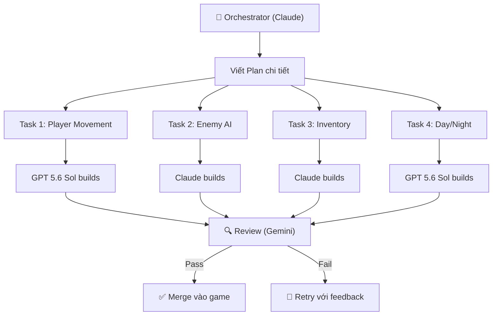

# 🎮 PLAN v2: Dùng AI Tạo Game Survival — Kịch Bản Presentation
## Đã cải tiến dựa trên 3 video reference

> **Thay đổi lớn so với v1:** Chuyển từ style "tutorial từng bước" sang **storytelling style** — show kết quả trước, giải thích sau, kèm behind-the-scenes và cả những lần AI fail.

---

## 🧠 KEY INSIGHTS RÚT RA TỪ 3 VIDEO REFERENCE

Trước khi vào plan, đây là những idea cốt lõi mà YouTuber này dùng — và chúng ta sẽ áp dụng:

### 1. **Orchestrator Pattern** (từ cả 3 video)
> *"Fable 5 will not build anything. It just hands out the work and checks what comes back. I called it the orchestrator."*

Không dùng 1 model cho mọi thứ. Mỗi model có vai trò riêng:
- **Fable** → Orchestrator (lên kế hoạch, quyết định lớn)
- **Claude/GPT** → Builder (code, models)
- **Gemini** → Research, review

### 2. **"One Job, One Fresh Session"** (từ "Stop Asking AI...")
> *"Do not ask for the whole game in one prompt. Every job gets its own clean session."*

Chia nhỏ. Mỗi task = 1 session mới. Model không phải "nhớ" 9 task khác → ít lỗi hơn, tốn ít token hơn.

### 3. **Color Bible** (từ cả 2 video game)
> *"Every model must use this. It's a contract. Otherwise every model could use a different shade."*

Tạo "hợp đồng" visual trước khi build. Mọi output phải tuân theo.

### 4. **Gauntlet Loop** (từ Space Game)
> *"The model spawns a few agents, one for each piece. When done, an independent critic can accept or send it back."*

Workflow: Build → Critic review → Accept hoặc Retry. Lặp cho tới khi đạt chất lượng.

### 5. **AI Testing: Measure + Look** (từ Space Game)
> *"First, let it measure... Then, let it look — screenshots + another agent tells you what's wrong."*

Hai cách test: chạy script đo metrics + chụp screenshot cho AI review.

### 6. **Show Failures** (từ cả 3 video)
> *"Something is wrong here... Bro, he's just cheating on the floor."*
> *"For the first few seconds, it actually looks solid. And then well, they just started flying."*

Audience yêu thích xem AI fail → sửa → thành công. Nó tạo narrative hấp dẫn.

---

## 🎬 KỊCH BẢN PRESENTATION (Storytelling Flow)

### Thời lượng: 30-40 phút | Tone: Casual, technical nhưng entertaining

---

### ACT 1: THE HOOK — "AI Làm Cái Này" (3 phút)

#### 📌 Slide 1: Title
**"Từ Con Số 0 Đến Game Hoàn Chỉnh — AI Làm Hết"**

*Mở đầu bằng DEMO GAME chạy thật.* Không nói gì nhiều, chỉ play game 30-60 giây:
- Player chạy trong map
- Đánh slime
- Nhặt đồ, mở inventory
- Ngày chuyển đêm
- Bắn cung, level up

> **Script nói:**
> "Mọi người thấy game này chứ? AI làm hết. Và ban đầu nó trông thế này..."
> *(Show screenshot game lúc mới bắt đầu — grey boxes, bugs)*
> "...sau 1 tuần, nó trông thế kia."

#### 📌 Slide 2: Con Số
Bắt chước style YouTuber — show numbers ấn tượng:

| | |
|---|---|
| ⏱️ **Thời gian** | 1 tuần |
| 🤖 **Models sử dụng** | 3 (Claude, Fable, GPT 5.6 Sol) |
| 💬 **Sessions AI** | 50+ conversations |
| 📝 **Scripts viết ra** | 30+ files GDScript |
| 🎨 **Scenes** | 25+ scenes Godot |
| 💰 **Chi phí API** | ~$XX (ước tính) |

---

### ACT 2: THE SETUP — "Công Cụ & Phương Pháp" (5 phút)

#### 📌 Slide 3: "My Setup — Đơn Giản Thôi"

> Bắt chước: *"My setup is simple."*

**Stack của mình:**

```
🎮 Game Engine:  Godot 4.2 (miễn phí, open-source)
🧠 Orchestrator: Claude (API paid) — lên plan, quyết định kiến trúc
🔬 Research:     Gemini — tìm hiểu Godot API, debug, review code
💻 Coding:       Claude + GPT 5.6 Sol — viết code thực tế
🎨 Art:          AI Image Gen + Free assets (itch.io)
```

**Tại sao nhiều models?**
> "Mỗi model có thế mạnh riêng. Claude giỏi planning và code phức tạp. GPT 5.6 Sol thì consistent hơn cho tasks lặp lại. Gemini thì research documentation cực nhanh."

#### 📌 Slide 4: "Rule #1 — ĐỪNG BAO GIỜ Hỏi AI Làm Cả Game Một Lần"

> Trích dẫn: *"Do not ask for the whole game in one prompt."*

**❌ SAI:**
```
"Hãy tạo cho tôi một game survival 2D hoàn chỉnh với 
player, enemies, inventory, day/night cycle..."
```

**✅ ĐÚNG:**
```
"Viết GDScript cho CharacterBody2D di chuyển 4 hướng, 
tốc độ 100px/s, animation sprite. Godot 4.2."
```

**Nguyên tắc:**
1. **1 job = 1 fresh session** — Model không phải nhớ 9 tasks khác
2. **Mỗi job phải testable** — Chạy xong là biết pass/fail ngay
3. **Model đọc ít hơn → sai ít hơn → tốn ít token hơn**

#### 📌 Slide 5: "Orchestrator Pattern — AI Quản Lý AI"



> **Script nói:**
> "Bước đầu tiên, tôi dùng Claude — model mạnh nhất — không phải để code. Mà để LÊN KẾ HOẠCH. Nó là 'ông sếp'. Nó không xây gì hết, nó chỉ phân việc và kiểm tra kết quả."

---

### ACT 3: THE BUILD — "Từng Bước Một" (15 phút)

> **Đây là phần chính. Mỗi bước follow pattern: Show kết quả → Giải thích prompt → Show cả lỗi nếu có**

#### 📌 Slide 6: "Bước 1 — The Plan"

**Prompt cho Claude (Orchestrator):**
```
Tôi muốn tạo game Survival 2D top-down bằng Godot 4.2 với GDScript.

Tính năng mong muốn:
- Player: di chuyển, animation, bắn cung
- Enemies: slime (chase + attack), skeleton
- Inventory: nhặt items, sử dụng potions
- Survival: health, hunger, thirst bars
- Day/night cycle
- TileMap world với spawner
- Menu: main menu, pause, game over
- NPC dialogue

Hãy viết plan chi tiết: chia thành sections, 
mỗi section có tasks nhỏ. 
Mỗi task phải có thể test độc lập.
Đánh dấu thứ tự ưu tiên.
```

**Claude trả về plan ~15-20 tasks, chia thành 6 sections.**

> **Script nói:**
> "Đây là plan Claude đưa ra. Mỗi section có tasks nhỏ bên trong. Và rule là: MỘT TASK = MỘT SESSION MỚI."

#### 📌 Slide 7: "Bước 2 — Player (The Fun Part)"

**Show video/gif: Player di chuyển trong game**

> "Player là thứ đầu tiên tôi build. Vì nếu player không chạy được, không có game."

**Prompt (gửi cho GPT 5.6 Sol):**
```
Godot 4.2, GDScript. CharacterBody2D.
Player di chuyển 4 hướng (WASD), tốc độ 100px/s.
AnimatedSprite2D với animations: walk_up, walk_down, walk_left, walk_right, idle.
Camera2D follow player.
Có thể bắn arrow bằng left click theo hướng mouse.
```

**GPT 5.6 Sol trả về ~50 dòng code → paste vào Godot → chạy → XONG.**

> **Script nói:**
> "50 dòng code. Tôi không viết dòng nào. Copy, paste, chạy. Player di chuyển."

#### 📌 Slide 8: "Bước 3 — Enemy AI (Show the Failure First!)"

> Bắt chước: *"Something is wrong here... Bro, he's just cheating on the floor."*

**Show video: Slime bug lần đầu** (đi xuyên tường, đứng im, hoặc chase quá nhanh)

> **Script nói:**
> "Lần đầu AI viết enemy code, con slime... nó không chase player. Nó đứng im. Hoặc tệ hơn, nó bay xuyên tường."

**Prompt lần 1:**
```
Viết GDScript enemy Slime cho Godot 4.2:
- CharacterBody2D, 3 states: IDLE, CHASE, ATTACK
- IDLE: wander ngẫu nhiên
- CHASE: khi player trong detection radius
- ATTACK: khi chạm player, gây damage
- Health bar, chết khi HP = 0
```

**Bug: Slime không detect player đúng.**

**Prompt fix (paste error vào):**
```
Slime không chase player. Error: "Cannot call method 'global_position' 
on null." Đây là code hiện tại: [paste code]
Fix giùm tôi.
```

**AI sửa → lần 2 chạy đúng.**

> **Script nói:**
> "Và đây là điều quan trọng: AI KHÔNG HOÀN HẢO. Lần đầu luôn có bug. Nhưng bạn chỉ cần paste lỗi lại cho AI, nó tự sửa. Đó là vòng lặp: Build → Test → Paste Error → Fix → Test lại."

#### 📌 Slide 9: "Bước 4 — Survival Systems (The Gauntlet Loop)"

> Bắt chước Gauntlet Loop concept

**Show: Health, Hunger, Thirst bars hoạt động**

```
Prompt → Claude viết code → Chạy test → 
Gemini review screenshot → "Hunger bar giảm quá nhanh" → 
Feedback cho Claude → Claude sửa → Test lại → Pass ✅
```

**Prompt:**
```
Godot 4.2 GDScript. Survival system:
1. Health: 100 HP, giảm khi bị enemy đánh, game over khi = 0
2. Hunger: 100, giảm 1 point mỗi 5 giây. HP giảm khi hunger = 0
3. Thirst: 100, giảm 1 point mỗi 4 giây. HP giảm khi thirst = 0
4. UI ProgressBar cho mỗi stat
5. Signal system để update UI
6. Apple: +10 HP, -10 hunger
7. Water: -10 thirst
```

> **Script nói:**
> "Ở đây tôi dùng Gauntlet Loop. Claude viết code → tôi chạy → chụp screenshot → paste vào Gemini hỏi 'có gì sai không?' → Gemini nói 'hunger bar giảm quá nhanh, player chết trong 30 giây' → tôi feedback lại Claude → Claude điều chỉnh. Lặp lại cho đến khi ổn."

#### 📌 Slide 10: "Bước 5 — Inventory System"

**Show: Inventory UI mở/đóng, nhặt items, sử dụng potions**

> "Inventory là phần phức tạp nhất. Nó cần: data model (Resource), UI rendering, interaction logic. Tôi chia thành 3 sub-tasks cho 3 sessions riêng biệt."

```
Session 1: "Viết inventory data model dùng Resource class..."
Session 2: "Viết inventory UI hiển thị slots từ data..."  
Session 3: "Viết logic nhặt item khi player nhấn E gần object..."
```

#### 📌 Slide 11: "Bước 6 — Day/Night Cycle"

**Show: Time-lapse ngày → đêm → ngày trong game**

**Prompt:**
```
Viết day/night cycle cho Godot 4.2:
- CanvasModulate thay đổi ánh sáng mượt
- 1 ngày = 120 giây thực
- Transition: sáng (Color(1,1,1)) → tối (Color(0.1,0.1,0.2))
- Đếm ngày, hiển thị "Day X" trên UI
- Signal khi chuyển ngày/đêm để đổi background music
```

> **Script nói:**
> "Day/night cycle — tưởng khó, nhưng thực ra chỉ là 1 CanvasModulate thay đổi màu theo thời gian. AI one-shot cái này luôn, không cần sửa gì."

#### 📌 Slide 12: "Bước 7 — World, Spawner, và Polish"

**Show: World hoàn chỉnh với items spawn, cây táo, lửa trại, NPC**

> "Cuối cùng là ghép hết lại. Spawner rải items trên map, NPC đứng nói chuyện, lửa trại cháy. Mỗi thứ là 1 task riêng, đã test riêng, giờ chỉ ghép vào world scene."

---

### ACT 4: THE COMPARISON — "So Sánh Models" (5 phút)

#### 📌 Slide 13: "Claude vs GPT 5.6 Sol — Ai Giỏi Hơn?"

> Bắt chước style so sánh Fable vs Opus

| Task | Claude (API paid) | GPT 5.6 Sol |
|------|-------------------|-------------|
| **Planning/Architecture** | 🏆 Xuất sắc — plan chi tiết, logical | Tốt nhưng hay thiếu edge cases |
| **Complex Logic** (enemy AI, state machine) | 🏆 Ít bug hơn, code sạch | Đôi khi generate code quá dài |
| **Repetitive Tasks** (bars, UI, menus) | Tốt | 🏆 Consistent, nhanh hơn |
| **Debugging** | 🏆 Hiểu context nhanh | Hay suggest sửa sai chỗ |
| **Shader/Effects** | Ngang nhau | Ngang nhau |
| **Tốc độ** | Chậm hơn ~20% | 🏆 Nhanh hơn |
| **Chi phí** | Đắt hơn | 🏆 Rẻ hơn/token |

> **Script nói:**
> "Không có model nào perfect. Claude giỏi reasoning, plan. GPT 5.6 Sol thì nhanh và rẻ cho tasks lặp lại. Gemini thì tôi dùng để research Godot docs và review. Dùng đúng model cho đúng việc."

#### 📌 Slide 14: "Gemini — The Silent Worker"

> "Gemini không viết code game cho tôi. Nhưng nó làm 2 việc cực quan trọng:"

1. **Research:** "Godot 4.2 CharacterBody2D API thay đổi gì so với 4.1?" → trả lời chính xác
2. **Review:** Paste screenshot game + hỏi "Nhìn UI này có vấn đề gì?" → "Health bar bị che bởi inventory panel"

---

### ACT 5: BEHIND THE SCENES — "Những Thứ AI Làm Sai" (5 phút)

> **Phần này CỰC KỲ QUAN TRỌNG** — đây là thứ audience nhớ nhất

#### 📌 Slide 15: "The Blooper Reel"

Show compilation các bugs hài hước:

| Bug | Nguyên nhân | Fix |
|-----|-------------|-----|
| 🐛 Slime bay xuyên tường | AI quên set collision mask | Paste error → AI sửa 1 dòng |
| 🐛 Player bắn arrow... về phía mình | Direction vector bị ngược | "Arrow bay ngược, fix giùm" → done |
| 🐛 Inventory hiện 999 sticks | Không có stack limit | "Thêm max stack = 99" → done |
| 🐛 Ngày/đêm chạy quá nhanh | Timer sai đơn vị (ms vs s) | AI tự nhận ra khi paste error |
| 🐛 NPC nói chuyện... khi player ở xa | Detection area quá lớn | Giảm radius từ 500 → 50 |

> **Script nói:**
> "Đây là phần yêu thích của tôi. AI KHÔNG HOÀN HẢO. Và đó CHÍNH LÀ POINT. Nó sai, bạn sửa, nó học. Vòng lặp 2-3 lần là xong. Quan trọng là bạn biết CÁCH HỎI AI sửa — paste lỗi, mô tả bug, và nó fix."

#### 📌 Slide 16: "Bài Học Lớn Nhất"

> Từ video: *"Quick tip. Don't ask AI for realistic meshes. It will not deliver. Simple shapes, it does well."*

**AI Giỏi Ở:**
- ✅ Logic code (movement, state machines, UI)
- ✅ Kiến trúc/planning
- ✅ Debug (paste error → fix)
- ✅ Repetitive patterns (bars, menus, spawners)
- ✅ Shader/effects đơn giản

**AI Yếu Ở:**
- ❌ Game design (quyết định game có vui không)
- ❌ Visual polish (pixel-perfect placement)
- ❌ Balancing (damage, spawn rate, difficulty curve)
- ❌ "Cảm giác" chơi game (feel, juice)
- ❌ Sáng tạo ý tưởng mới thật sự

---

### ACT 6: THE TAKEAWAY (5 phút)

#### 📌 Slide 17: "Workflow Tổng Kết"

```
1. 💡 IDEA        → Bạn nghĩ ra game gì
2. 🎨 REFERENCE   → Tìm reference visual (Pinterest, game khác)
3. 📋 PLAN        → Claude viết plan chi tiết
4. 🔨 BUILD       → 1 task = 1 session, model phù hợp
5. 🧪 TEST        → Chạy + AI review screenshot
6. 🔄 ITERATE     → Bug → paste error → AI fix → test lại
7. 🎨 POLISH      → Lighting, sound, shader effects
8. 🚀 SHIP        → Export & share
```

#### 📌 Slide 18: "Chi Phí Thực Tế"

| Hạng mục | Miễn phí | Chi phí API |
|----------|----------|-------------|
| Godot Engine | ✅ Free | — |
| Art assets (itch.io) | ✅ Free | — |
| Sound (Pixabay, freesound) | ✅ Free | — |
| Claude API | — | ~$10-30 |
| GPT 5.6 Sol API | — | ~$5-15 |
| Gemini (research) | ✅ Free tier đủ | — |
| **TỔNG** | | **~$15-45** |

> *Bắt chước từ Fable vs Opus video: show chi phí thực — audience luôn muốn biết*

> **Script nói:**
> "Tổng chi phí API: khoảng $15-45 cho cả project. Rẻ hơn mua 1 game AAA. Và bạn đang TẠO RA game, không phải chơi game."

#### 📌 Slide 19: "Nếu Bạn Muốn Thử — Bắt Đầu Từ Đâu?"

**Cho người chưa biết gì:**
1. Cài Godot (5 phút)
2. Đăng ký tài khoản AI (ChatGPT free cũng được)
3. Copy prompt đầu tiên: *"Viết GDScript player di chuyển WASD..."*
4. Paste code vào Godot → Chạy
5. Nếu lỗi → paste lỗi vào AI → AI sửa
6. **Repeat. Đó là tất cả.**

**Cho developer:**
1. Dùng Claude/Cursor/Antigravity để code trực tiếp
2. Orchestrator pattern: model mạnh nhất plan, model khác build
3. Gauntlet Loop cho quality
4. Multi-model setup tiết kiệm chi phí

#### 📌 Slide 20: "Q&A + Live Demo"

**Live demo suggestion (nếu có thời gian):**
Thêm 1 enemy mới vào game ngay trên sân khấu:
```
"Thêm enemy Frog vào game, nó nhảy ngẫu nhiên, 
khi player đến gần nó nhảy chạy trốn thay vì tấn công."
```
→ AI viết code → paste → chạy game → audience thấy frog nhảy ngay!

---

## 🎯 PRO TIPS CHO PRESENTER

### Tip 1: Mở Đầu = Demo Game
Đừng bắt đầu bằng slide text. Play game 30-60 giây. Audience phải "wow" trước.

### Tip 2: Show Bugs = Entertainment
Chuẩn bị sẵn 3-5 video/gif bugs hài hước. Audience THÍCH xem AI fail.

### Tip 3: Số Liệu Cụ Thể
> *"One week, four models, more than a hundred agents"*

Đếm thật: bao nhiêu sessions, bao nhiêu files, bao nhiêu tiền API. Con số cụ thể gây ấn tượng hơn nói chung chung.

### Tip 4: Side-by-Side Comparison
Nếu bạn có dùng nhiều models (Claude vs GPT), show cùng 1 task — 2 kết quả khác nhau. Audience thích so sánh.

### Tip 5: "Before & After"
Mỗi feature: show trước (grey box / bug) → sau (hoàn chỉnh). Tạo narrative arc.

### Tip 6: Giọng Nói Casual
YouTuber này nói rất casual: "Bro, he's just cheating on the floor." Đừng quá formal. Present như đang kể chuyện cho bạn bè.

### Tip 7: Để Audience Tự Thử
Cuối presentation, share link repo + list prompts. Cho họ thử ngay nếu có laptop.

---

## 📝 SO SÁNH v1 vs v2

| | Plan v1 | Plan v2 (cải tiến) |
|---|---------|---------------------|
| **Style** | Tutorial step-by-step | Storytelling + behind-the-scenes |
| **Mở đầu** | Title slide | DEMO game chạy thật |
| **AI tools** | Generic (ChatGPT, Claude) | Stack cụ thể (Claude API, Fable, Gemini, GPT 5.6 Sol) |
| **Flow** | Giải thích → Code | Show kết quả → Giải thích → Show bugs |
| **Bugs/Failures** | Không có | Có section riêng — entertainment |
| **So sánh models** | Không | Có bảng so sánh chi tiết |
| **Chi phí** | Không đề cập | Có breakdown cụ thể |
| **Concepts** | Cơ bản | Orchestrator, Gauntlet Loop, Color Bible, One Job One Session |
| **Tone** | Formal, dạy học | Casual, kể chuyện |

---

> [!TIP]
> **Killer move cho presentation:** Record lại quá trình bạn dùng AI tạo game (screen recording). Cắt thành video 2-3 phút montage: prompt → code xuất hiện → paste vào Godot → game chạy → bug → fix → chạy lại. Background music epic. Audience sẽ MÊ.
